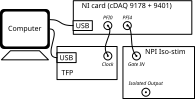
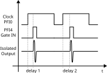
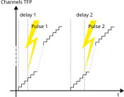

Signal Generation and Acquisition
=================================

The Tr-TFP project is designed to interface a computer with two independent devices: a Tandem Fabry-Perot (TFP) interferometer and a National Instruments (NI) data acquisition card. The TFP is used to capture the Brillouin spectrum, while the NI card is used to time the beginning of each acquisition and send a precisely delayed pulse with respect to the beginning of the acquisition. This pulse is used to trigger a signal. The goal of this setup is to reconstruct the BLS response of the sample to the pulse.

Overview of the Setup
---------------------

The system consists in a computer reading data from a TFP interferometer and a NI data acquisition card. The TFP is used to capture the Brillouin spectrum, using a CW laser source. The TFP inputs a signal (Clock) that is captured by the NI card on a PFI port. The NI card initiates a secondary signal (Trigger) on another PFI port precisely delayed (<µs resolution) with respect to the Clock signal. The delay is controlled by the computer that adjusts it after a pre-defined number of spectra captured from the TFP. 

*Figure 1: Connection schematics between the PC, TFP, and NI device.*

Signal Generation
-----------------

The NI device generates pulses to trigger measurements and synchronize the scanning of the TFP interferometer with a precisely timed delay. The delay between the pulse generated by the NI card and the pulse generator can be neglected. Alternatively, it can be accounted for programmatically inside the computer.

*Figure 2: Diagram of the generated and acquired signals.*

TFP Scanning Mechanism
----------------------

The TFP interferometer scans through a range of frequencies to create the Brillouin spectrum continuously, with a predefined, precisely timed behavior. To visualize the behavior of the device, we can consider that the pulses are essentially triggered at a different channel for each new delay.

*Figure 3: Diagram illustrating the scanning mechanism of the TFP interferometer.*

Data Acquisition Flow
---------------------

1. **Triggering**: The NI device sends a trigger signal to start the TFP scan.
2. **Scanning**: The TFP interferometer performs the frequency scan.
3. **Photon Counting**: The NI device records the photon counts from the TFP detector on a high-speed counter channel.
4. **Data Transfer**: The recorded counts are transferred to the PC for processing and visualization.
5. **Averaging**: Multiple cycles can be averaged to improve the signal-to-noise ratio.
